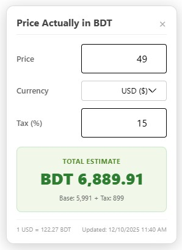

# Price Actually in BDT (প্রাইস অ্যাকচুয়ালি ইন বিডিটি) 💸

[English Version](README_EN.md)

**অনলাইন শপিংয়ে "কত ডলার" মানে আসলে "ব্যাংক কত টাকা কাটবে" নিয়ে দুশ্চিন্তা?**

সমাধান এই ক্রোম এক্সটেনশন **Price Actually in BDT** 

## এক নজরে ফিচারসমূহ ✨

* **সিলেক্ট করুন আর দেখুন:** ওয়েবসাইটের যেকোনো দাম (যেমন: "$19.99") হাইলাইট করে রাইট-ক্লিক করলেই টাকায় দেখতে পারবেন। পেজের যেকোনো খালি জায়গায় রাইট-ক্লিক করে ক্যালকুলেটরটি ওপেন করা যাবে। 
* **সব কারেন্সি চেনে:** ডলার, ইউরো, পাউন্ড থেকে শুরু করে রিয়াল, দিনার কিংবা রুপি—সবই এর চেনা। সিম্বল দেখলেই ও বুঝে নেয় ওটা কোন দেশের টাকা। ১৬০+ কারেন্সি সাপোর্ট করে এটি!

* **যেখানে খুশি রাখা:** ড্র্যাগেবল ইন্টারফেস, চাইলে মাউস দিয়ে টেনে পপআপটি স্ক্রিনের যেকোনো কোণায় রেখে দিয়ে কাজ সারতে পারেন। 

* **ইন্সটল করলেই রেডি:** ব্রাউজার রিফ্রেশ দেওয়ার ঝামেলা নেই, ইন্সটল করেই কাজে নেমে পড়ুন।

* **একাধিক ক্যালকুলেটর:** চাইলে এক স্ক্রিনে অনেকগুলো পপআপ খুলে রেখে দামের তুলনা করতে পারেন।
* **পরিবর্তন যোগ্য ট্যাক্স:** আমাদের ব্যাংকগুলো সাধারণত ১৫% ট্যাক্স কাটে। কিন্তু আপনার পছন্দমতো ট্যাক্স রেট ডিফল্ট হিসেবে সেট করে দিন, বারবার টাইপ করার দরকার নেই।

## ইন্সটলেশন (সহজ ৫ ধাপ) 🛠️

১. [সর্বশেষ রিলিজ](https://github.com/MatrixRex/Price-Actually-BDT/releases/latest) থেকে `.zip` ফাইলটি নামিয়ে নিন।  
২. জিপ ফাইলটি সুবিধামতো ফোল্ডারে **আনজিপ** করুন।  
৩. ক্রোম ব্রাউজারের অ্যাড্রেস বারে `chrome://extensions/` লিখে এন্টার দিন।  
৪. উপরের ডান কোণা থেকে **Developer mode** অন করে দিন।  
৫. **Load unpacked** বাটনে ক্লিক করে আনজিপ করা ওই ফোল্ডারটি সিলেক্ট করুন।

**ব্যস! এবার ব্যাবহার করার পালা!**

## কিভাবে ব্যবহার করবেন? 🤔

* **দাম দেখুন:** যেকোনো দাম সিলেক্ট করুন → রাইট ক্লিক → **Price Actually in BDT**। অথবা খালি যায়গায় রাইট ক্লিক করেও ক্যালকুলেটর টি ব্যাবহার করা যাবে।
* **সেটিংস:** গিয়ার আইকনে (⚙️) ক্লিক করে আপনার পছন্দমতো ট্যাক্স রেট বা মোড পরিবর্তন করুন।
* **Persistent Popup:** এইটা অন থাকলে পপআপের বাইরে ক্লিক করলেও পপআপ বন্ধ হবে না।
* **Single Instance:** এইটা অন থাকলে নতুন পপআপ খুললে পুরানো পপআপ বন্ধ হবে।
* **Default Tax:** এইখানে আপনার পছন্দমতো ট্যাক্স রেট সেট করুন।
* **ঝটপট মুছে ফেলুন:** স্ক্রিনের সব পপআপ এক ক্লিকেই মুছে ফেলতে ট্র্যাশ আইকন (🗑️) ব্যবহার করুন।

## টেকনিক্যাল কিছু গালভরা বুলি 🤓

* **Manifest V3:** ক্রোম এক্সটেনশনের একদম আধুনিক আর নিরাপদ ভার্সনে তৈরি।
* **ExchangeRate-API:** একদম লেটেস্ট এক্সচেঞ্জ রেট ফেচ করা হয় এবং ২৪ ঘণ্টার জন্য ক্যাশ করে রাখা হয়, যাতে বারবার ইন্টারনেটে হিট না করতে হয়।

## ফোল্ডার স্ট্রাকচার 📂

* `manifest.json`: এক্সটেনশনের মাথা।
* `background.js`: পর্দার অন্তরালে সব কারেন্সি রেট আর রাইট-ক্লিকের হিসাব সামলায়।
* `content.js`: যা দেখছেন তার সবটাই এখানে। নকশা থেকে শুরু করে ড্র্যাগ-অ্যান্ড-ড্রপ সব লজিক।
* `images/`: আইকন।

---
**শুভ কেনাকাটা! ❤️**